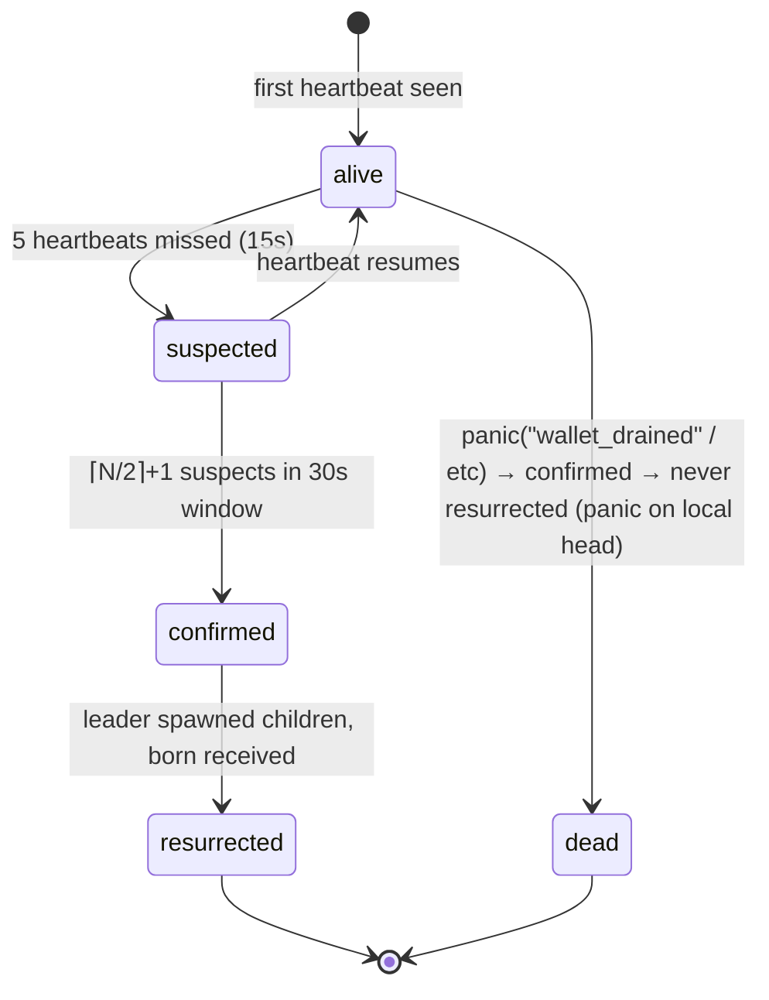
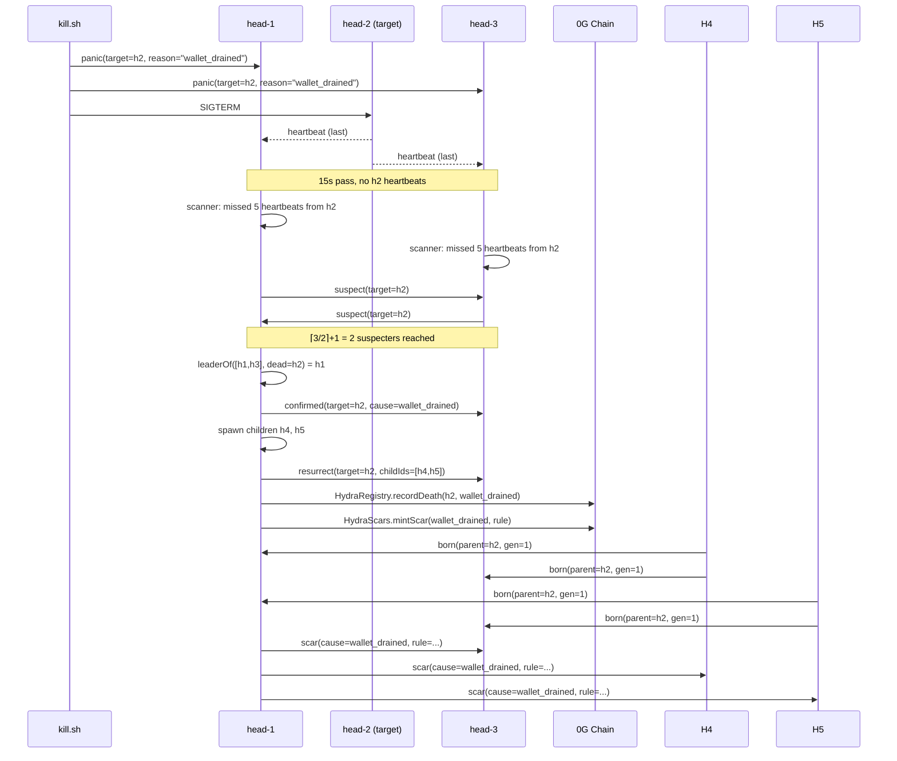
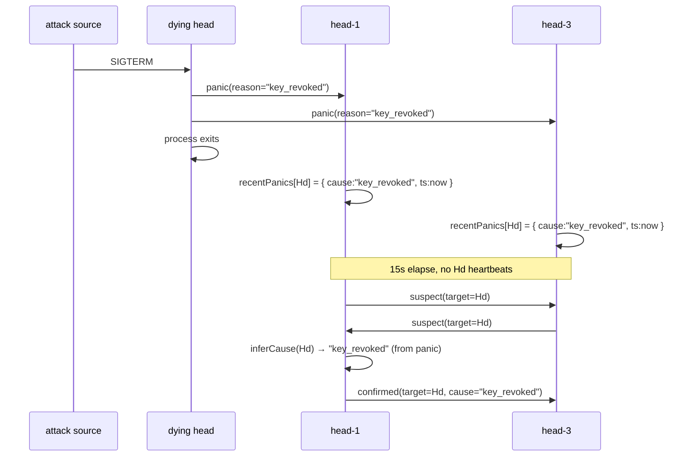

# HYDRA AXL Protocol

> Protocol specification for HYDRA's swarm coordination layer. Written
> against [Gensyn AXL](https://github.com/gensyn-ai/axl) as the underlying
> P2P transport. Version 1, the v1 implementation is what ships at
> `hydra.hacklabs.in`. v2 work flagged at the bottom.

## Overview

[Gensyn AXL](https://github.com/gensyn-ai/axl) is an encrypted peer-to-peer
transport built on Arceliar's `ironwood` library. It gives HYDRA three
properties that would otherwise need to be built from scratch: TLS-encrypted
TCP between peers, peer discovery without a central registry, and routed
delivery of opaque application payloads. AXL itself does not impose a
message format — it just moves bytes between identified peers.

HYDRA layers a 7-message coordination protocol over that transport. Each
head broadcasts heartbeats; missing heartbeats trigger consensus messages;
quorum agreement triggers resurrection messages; new children announce
themselves; the swarm broadcasts learned defenses; any head can panic to
freeze the swarm sub-second. The protocol is deliberately small — seven
message types is enough for a swarm-of-three to coordinate failures and
preserve memory across deaths. Adding more types is a v2 concern, not a
v1 surface.

This document specifies all 7 messages, the state transitions on a head's
side, the signing model, two reference sequence flows, the observability
model, and current limitations.

## Architecture

HYDRA runs each head as **two separate OS processes**: a Go-language AXL
sidecar (the gensyn-ai/axl binary at `axl/bin/axl-node`) and a Node.js
head process (`agents/src/head.ts`). The sidecar handles transport — TLS,
peer discovery, encryption, routing — and exposes a small HTTP API on
localhost. The head process handles the protocol: signing outgoing
messages, dispatching received ones, running the consensus state machine,
spawning children. The split keeps the protocol layer free to use any
language without re-implementing TLS or P2P routing.

On the live deployment three of each pair run on a single Ubuntu host:

```
                          + - - - - - - - - - - - - - - - - +
                          |  Node head process              |
                          |  agents/src/head.ts             |
                          |  - protocol logic               |
                          |  - signing                      |
                          |  - dispatch                     |
                          + - - - - - - - - - - - - - - - - +
                                       │   localhost
                                       │   POST /send
                                       │   GET  /recv
                                       ▼
                          + - - - - - - - - - - - - - - - - +
                          |  AXL sidecar (Go)               |
                          |  axl/bin/axl-node               |
                          |  - TLS                          |
                          |  - peer discovery               |
                          |  - encrypted routing            |
                          + - - - - - - - - - - - - - - - - +
                                       │   tls://9001 (h1)
                                       │   tls://9011 (h2)
                                       │   tls://9021 (h3)
                                       ▼
                                ironwood / TLS / TCP

                                 (other heads' sidecars)
```

systemd units `hydra-axl@1`, `@2`, `@3` and `hydra-head1`, `2`, `3` keep
the six processes alive across reboots. A Node head crash takes only
its own protocol layer down — the AXL sidecar keeps routing, and on
restart the head re-attaches to the same encrypted mesh without re-
issuing keys.

## Message types

The full union of valid AXL payloads HYDRA emits is defined in
[`shared/types.ts`](../shared/types.ts) under `AXLMessage`. The seven types
are listed below in the order a swarm experiences them in a typical
attack: heartbeat → suspect → confirmed → resurrect → born → scar (with
panic available out-of-band at any moment).

### 1. heartbeat

| | |
|---|---|
| Constant | `HEARTBEAT` |
| Purpose | Proof of life. Tells every other head "I'm still here." |
| Sender | Any head, every 3 seconds |
| Recipients | Broadcast — every live peer in the mesh |
| Trigger | `setInterval` in `agents/src/heartbeat.ts:38` |
| Receiver action | Update `mesh.lastSeen[peerId] = now`, mark status alive |
| Volume | **42,628** received, **59,494** sent across the swarm's lifetime |

```ts
{ type: "heartbeat"; from: HeadId; gen: number; ts: number; sig: string }
```

The `sig` field is a hex-encoded ed25519 signature over `${id}:${gen}:${ts}`
produced by the sender's private key. See [Identity and signing](#identity-and-signing)
for the verify-on-receive caveat.

### 2. suspect

| | |
|---|---|
| Constant | `SUSPECT` |
| Purpose | "I think this peer is dead." First step of consensus. |
| Sender | Any head whose scanner notices a peer missed 5 heartbeats (15s) |
| Recipients | Broadcast — every other live peer |
| Trigger | `consensus.ts:177` scanner loop, every 1s |
| Receiver action | Add sender to `suspecters[target]` set; if `\|suspecters\| >= ⌈N/2⌉+1`, escalate to confirmed |
| Volume | 8 received, 6 sent |

```ts
{ type: "suspect"; from: HeadId; target: HeadId; ts: number }
```

A head only broadcasts a suspect once per target. The `mesh.markStatus`
flip to `"suspected"` is local; the broadcast is the public claim.

### 3. confirmed

| | |
|---|---|
| Constant | `CONFIRMED` |
| Purpose | Quorum has agreed the target is dead, with attributed cause |
| Sender | Leader (lowest live peer-id in suspecters set) |
| Recipients | Broadcast — every live peer |
| Trigger | `evaluateQuorum` in `consensus.ts:109` when `suspecters.size >= ⌈N/2⌉+1` |
| Receiver action | `markConfirmed(target, cause)` locally; do not echo. The leader will fire `onConfirmedDeath` callback to drive resurrection. |
| Volume | 4 received, 3 sent |

```ts
{ type: "confirmed"; from: HeadId; target: HeadId; cause: DeathCause; ts: number }
```

`cause` is one of `process_killed | api_timeout | wallet_drained | key_revoked` —
the four hard-coded causes the agent's scar lookup table supports. The
cause is inferred from the most recent `panic` message about `target`
(see `inferCause` in `consensus.ts:77`); if no panic was received, the
default is `process_killed`.

### 4. resurrect

| | |
|---|---|
| Constant | `RESURRECT` |
| Purpose | "I am the leader for this death; here are the children I will spawn." |
| Sender | Leader only (the `confirmed` message's `from`) |
| Recipients | Broadcast — every live peer |
| Trigger | `onConfirmedDeath` callback in `head.ts:166` |
| Receiver action | Log; await `born` messages from the named children |
| Volume | 12 received, 6 sent |

```ts
{
  type: "resurrect";
  from: HeadId;     // the leader
  leader: HeadId;   // === from, redundancy for clarity
  target: HeadId;   // the dead head
  childIds: HeadId[];   // the two new ed25519 peer-ids
  round: number;        // resurrection sequence number
}
```

Recipients DON'T need to verify the leader's authority on receipt —
leadership is deterministic (lowest live peer-id), so any head independently
arriving at the same conclusion accepts the resurrect. If a non-leader
forged a resurrect, peers would notice the `from` doesn't match their
own leader-of computation and ignore.

### 5. born

| | |
|---|---|
| Constant | `BORN` |
| Purpose | "I am a new head; here is my parent and my generation." |
| Sender | Any newly spawned child (PARENT_ID env set) |
| Recipients | Broadcast to all live peers known via `keys/*.pem` |
| Trigger | `head.ts:152` — first action after AXL connect, before the first heartbeat tick |
| Receiver action | `mesh.registerDynamic(peerId)` to add the new peer to the live set so the next heartbeat round routes correctly |
| Volume | 8 received, 42 sent (each `born` is broadcast to ~5–10 peers per child, two children per resurrection) |

```ts
{
  type: "born";
  from: HeadId;            // the new child
  parent: HeadId;          // the head that died
  gen: number;             // parent's generation + 1
  scar: Scar | null;       // the most recent scar the child inherits
}
```

Without `born`, peers infer a child's existence from the first heartbeat
it sends. That works but leaves a brief window where a peer might route
a different message at a child it doesn't yet know about.

### 6. scar

| | |
|---|---|
| Constant | `SCAR` |
| Purpose | "The swarm has learned a new defense rule. Inherit it." |
| Sender | Leader, after persisting the scar to global storage |
| Recipients | Broadcast to all live peers |
| Trigger | `onLeadershipResurrection` in `head.ts:217` if the cause is new (not in registry) |
| Receiver action | `scarRegistry.add(scar)` locally. Idempotent — same cause + rule replaces only if newer learnedAt timestamp |
| Volume | 2 received, 2 sent |

```ts
{
  type: "scar";
  from: HeadId;
  scar: {
    id: string;            // "scar_<cause>_<learnedAt>"
    cause: DeathCause;
    rule: { trigger: string; check: string; mitigation: string };
    learnedAt: number;
    learnedFrom: HeadId;
    generation: number;
  };
}
```

Each scar is also written to chain (`HydraScars.mintScar`) and to 0G
Storage (`uploadJsonToOG`) so the AXL broadcast is one of three
durability paths. Receivers don't acknowledge — drop-on-receive is the
contract; the leader is responsible for retry on transport failure.

### 7. panic

| | |
|---|---|
| Constant | `PANIC` |
| Purpose | Sub-second emergency freeze. Bypasses consensus latency. |
| Sender | Any head, including the dying head's SIGTERM handler or `kill.sh --cause` |
| Recipients | Broadcast to all live peers |
| Trigger | `diagnostics.ts:28` SIGTERM handler; `kill.sh` injects a panic with attributed cause before stop |
| Receiver action | Record cause in `recentPanics[from]` (used by `inferCause` later when consensus confirms); first-panic-wins within 30s window |
| Volume | 30 received, 33 sent |

```ts
{ type: "panic"; from: HeadId; reason: string; ts: number }
```

Panic is the only message that supersedes the consensus window. A panic
with `reason="wallet_drained"` arriving 14s before the 15s suspect
threshold will still be recorded as the cause when consensus reaches
`confirmed` 1s later. This is how `kill.sh --cause <X>` lets a demo
attribute a specific cause to an attack without waiting for the
scanner to guess.

## State machine

A head's view of any other head goes through the following states.
Initial state is `alive` at boot once a heartbeat has been seen.



The leader for a confirmed-death is the lowest live peer-id in the
suspecters set, computed independently by every peer via the same
`leaderOf()` function (`consensus.ts:48`). Determinism removes the need
for a leader-election message round.

## Identity and signing

Every head holds an ed25519 keypair generated at deploy time and stored
as a PEM file at `keys/h{N}.pem`. The public key is the head's `peerId`
(also the AXL sidecar's identifier — head and sidecar share identity).
The keypair is loaded once at boot by `agents/src/identity.ts:loadIdentity`.

**Sign-on-send.** The agent computes `identity.sign(payload)` over the
serialised content of every outgoing heartbeat. The signature is attached
as a hex-encoded `sig` field (`heartbeat.ts:25`). Other six message
types do not currently include a `sig` field in their type definition
in `shared/types.ts`. The `sigPresent` flag in each `axl.send` event
log entry reflects this — `true` for heartbeat, `false` for the others.

**Verify-on-receive.** Not wired in v1. The consensus dispatcher trusts
incoming messages on the basis that AXL's TLS layer ensures only
authorised peers can deliver bytes to the local sidecar. This is a
*transport*-layer trust assumption; if a malicious peer is admitted
to the AXL mesh, it can in principle forge any non-heartbeat message.

**Honest disclosure.** The protocol is therefore not cryptographically
secure at the application layer in v1. The mitigations are:

1. AXL's TLS encrypts wire traffic, so eavesdropping doesn't help an
   attacker forge messages.
2. The mesh is not openly joinable — peer admission goes through
   ironwood's identity-bound routing, so a forger needs an existing
   ed25519 keypair admitted to the mesh.
3. The consensus state machine requires `⌈N/2⌉+1` suspecters to
   confirm a death. A single forger cannot unilaterally kill a peer.

Verify-on-receive plus signed lifecycle messages (closing the gap to
all 7 types signed-and-verified) is **the v1 → v2 graduation step.**
Estimated scope: ~150 lines split across (a) sign-on-send for the
remaining 6 types, (b) peer pubkey discovery from `keys/*.pem`,
(c) verify-on-receive in the dispatcher.

## Sequence flows

### Flow 1 — Kill → resurrect → scar broadcast

The central HYDRA ritual. Some peer dies (with attributed cause via
panic), the swarm reaches consensus, the leader resurrects two children,
the scar broadcasts to the whole mesh.



End state: swarm went from `{h1, h2, h3}` to `{h1, h3, h4, h5}`. The
scar registry on every surviving head and every future child contains
the `wallet_drained` rule. On chain, `HydraScars.totalSupply` increased
by 1 and the dead head's balance was redistributed via Treasury.

### Flow 2 — Panic → freeze (sub-second emergency path)

Panic is the only path that intentionally bypasses the 15s consensus
window. The receiving head does not need to wait for quorum to start
recording the cause; it just stamps `recentPanics[from]` so that when
the scanner-driven consensus inevitably catches up, the cause is
already attributed.



Total time from SIGTERM to `confirmed`: ~15s (the heartbeat-miss window).
Without the panic, `inferCause` would default to `process_killed`. With
panic, the cause is correctly `key_revoked` even though the dying head
exited before consensus completed.

## Observability

All AXL traffic is logged to `logs/events.jsonl` on the live host. Every
outgoing message produces an `axl.send` event, every received message
produces an `axl.recv` event. Volumes as of D6 evening:

| Type | recv | send | Notes |
|---|---|---|---|
| heartbeat | 42,628 | 59,494 | 3s tick × N heads × M peers each |
| panic | 30 | 33 | 4 attacks fired panic; SIGTERM handler also broadcasts |
| resurrect | 12 | 6 | 4 attacks each broadcast resurrect to 2-3 peers |
| born | 8 | 42 | 4 attacks × 2 children × ~5 known peers each ≈ 40 |
| suspect | 8 | 6 | First-suspecter-only-broadcasts logic |
| confirmed | 4 | 3 | One per attack, leader-only |
| scar | 2 | 2 | Only fires for new causes; deduplicated by registry |

Cross-node delivery was verified during the D6 AXL diagnostic by stopping
`hydra-axl@2` (without stopping the head-2 Node process) and observing
that heads 1 and 3 immediately surfaced `Headers Timeout Error: send to
f17413e08d…` warnings — proving sends route through the local AXL sidecar
rather than a localhost shortcut. Recovery on `systemctl start
hydra-axl@2` was clean within 4 seconds.

Per-attack message volume runs around 800 axl.send events (attack #3
captured 817 in its 30s window) — heartbeats from all heads continue
firing during the attack, plus the lifecycle events (panic, suspect,
confirmed, resurrect, born, scar) for the death itself. Real-time
visibility of all 7 types is available at
[`/chronicle` Section iv](https://hydra.hacklabs.in/chronicle).

## Known limitations / v2

The following gaps are intentional v1 cuts; each maps to a concrete v2
work item:

1. **ed25519 verify-on-receive** — only sign-on-send is wired in v1
   (heartbeat only). Closing the gap is ~150 lines split across three
   commits: extend `AXLMessage` types with `sig`, peer-pubkey discovery
   from `keys/*.pem` at boot, dispatcher verify hooks. v2 build target.

2. **Single-VPS deployment** — all 6 processes (3 AXL sidecars + 3 head
   processes) run on the same Ubuntu 24.04 host at `hydra.hacklabs.in`.
   The protocol is region-agnostic; AXL's encrypted P2P transport handles
   cross-continent latency the same way it handles localhost. v2: deploy
   one head per region.

3. **Children orphaned on leader Node restart** — children spawned by
   resurrection are `child_process.spawn` descendants of the leader's
   Node process. systemd's `Restart=always` on the leader takes the
   children with it. v2: have resurrection write a per-child systemd
   unit file and `systemctl start` it instead, so children become
   first-class managed services.

4. **Scar dedup is by cause, not rule hash** — `scarRegistry.add(scar)`
   replaces if the same cause arrives with a newer `learnedAt`
   timestamp. If two heads generate distinct rules for the same cause
   (only possible if the lookup table changes), the latest wins. v2:
   content-addressed scars by sha256 of the rule struct.

5. **Born messages are unencrypted at the application layer** — AXL
   provides transport encryption, but a born message's parent + gen
   fields are visible to any admitted peer. This is intentional in v1
   (peers need to know about new mesh members), but v2 may move the
   `scar` field of `born` to a separate encrypted-to-self channel for
   children to fetch on demand.

## References

- [Gensyn AXL repository](https://github.com/gensyn-ai/axl) — the
  underlying P2P transport. HYDRA uses the production `axl-node` binary,
  built from source at deploy time (`make build`).
- [`agents/src/axl/client.ts`](../agents/src/axl/client.ts) — HTTP client
  the head process uses to send/recv via the local sidecar.
- [`agents/src/axl/mesh.ts`](../agents/src/axl/mesh.ts) — peer registry,
  `markSeen`, `livePeers`, status tracking.
- [`agents/src/consensus.ts`](../agents/src/consensus.ts) — `evaluateQuorum`,
  `inferCause`, `handleSuspect`, `handleConfirmed`, `handlePanic`.
- [`agents/src/heartbeat.ts`](../agents/src/heartbeat.ts) — 3s tick,
  signing, broadcast.
- [`agents/src/resurrection.ts`](../agents/src/resurrection.ts) — child
  spawn, leader logic.
- [`agents/src/scars.ts`](../agents/src/scars.ts) — scar persistence,
  broadcast, registry.
- [`shared/types.ts`](../shared/types.ts) — the AXLMessage union.
- [Live observability](https://hydra.hacklabs.in/chronicle) — Section iv
  surfaces lifecycle events with per-type colour coding; Section iv
  has a collapsed sub-section for the heartbeat firehose.
- [`docs/ADVERSARIAL_TESTING.md`](./ADVERSARIAL_TESTING.md) — three
  consensus bugs caught during pre-fire verification, each with the
  AXL-message-level diagnosis that surfaced them.
